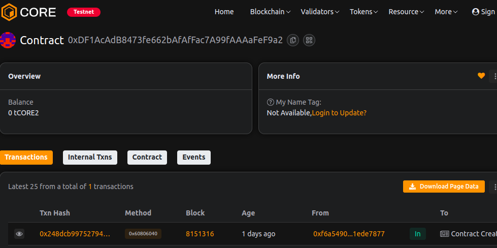

# Web3Fusion

### Project Description
Web3Fusion is a blockchain-based decentralized solution built for efficiency and minimal gas usage.

### Project Vision
To empower developers and users through transparent, scalable, and secure smart contracts.

### Key Features
- Minimal gas consumption
- Transparent ownership
- Simple data storage and retrieval
- Secure and modular architecture

### Future Scope
Future versions will include extended smart contract modules, enhanced automation, and integration with Web3 DApps.

### Contract address:
0xDF1AcAdB8473fe662bAfAfFac7A99fAAAaFeF9a2
